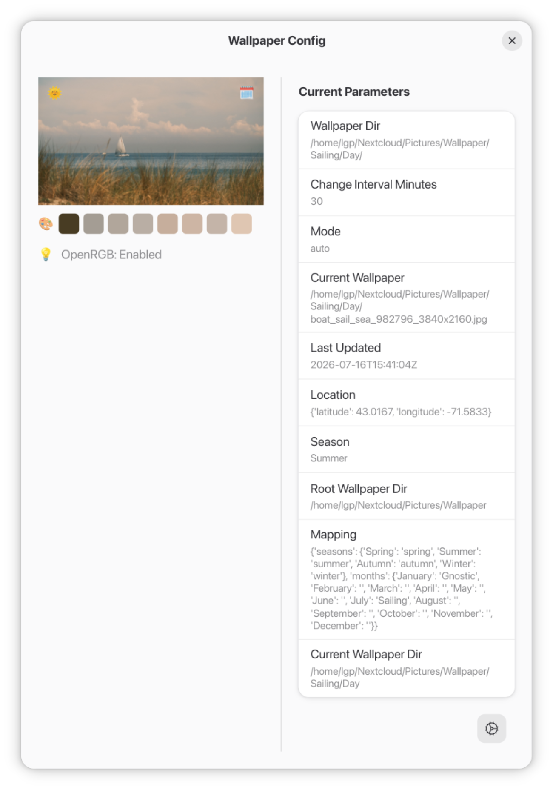
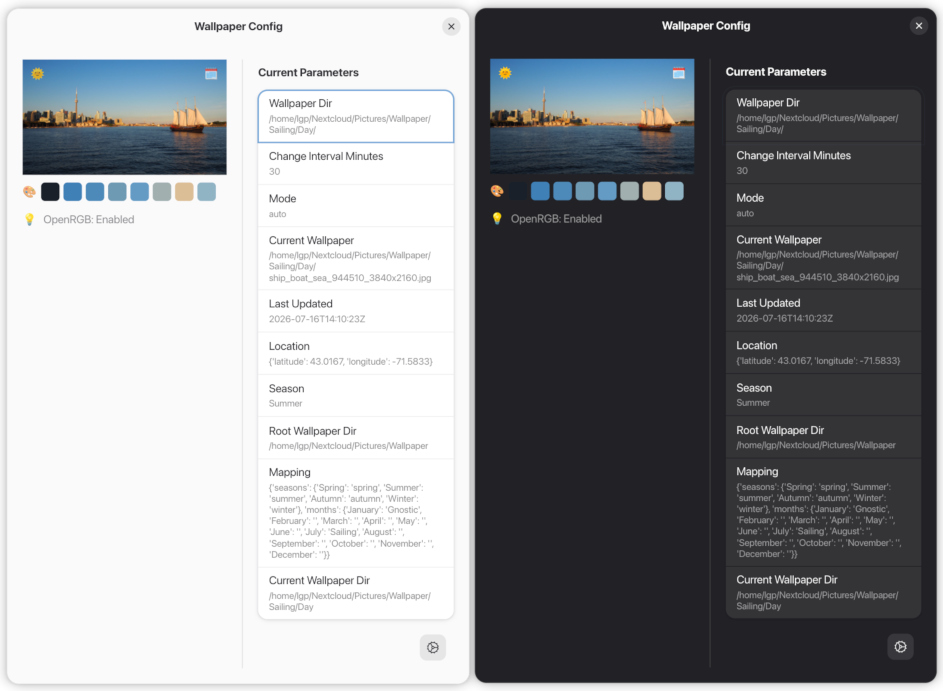

# Plaster

Plaster is a Python-based desktop utility designed to automate wallpaper rotation, theme generation, and hardware lighting control via OpenRGB. It follows Linux XDG standards for configuration and is built to integrate seamlessly with your desktop environment.

## Features

*   **Automated Wallpaper Management:** Keep your Gnome desktop fresh with automated rotations based on your directory structure.
*   **Theme Integration:** Automatically matches your system theme and generates color palettes.
*   **OpenRGB Sync:** Sync your hardware lighting to complement your current wallpaper and environment.
*   **XDG Compliant:** Clean configuration management using standard `~/.config` and `~/.cache` locations.

## Preview

| Light Mode | Dark Mode |
| :---: | :---: |
|  |  |

*(Note: The interface dynamically adapts to your system theme.)*

## Auto Mode Logic & Directory Structure

When running in **Auto Mode**, Plaster evaluates rules in a specific hierarchical priority to pick the right image directory. It also respects day/night context by automatically looking into `Day` or `Night` subdirectories if they exist within the resolved path.

### Evaluation Priority

Plaster resolves wallpaper directories using the following cascade:

1. **Special Days Override (Priority 0):** Checks if today matches any configured special events or holidays. If matched, it immediately uses that designated folder or file.
2. **Month (Priority 1):** Checks if a specific directory is mapped to the current calendar month (e.g., `January`, `February`).
3. **Season (Priority 2):** If no month rule matches, it calculates the current astronomical season (`Winter`, `Spring`, `Summer`, `Autumn` / `Fall`) and maps to the corresponding folder.
4. **Static / Fallback (Priority 3):** If no temporal rules match, it defaults to your static configuration directory or falls back to your system's default GNOME wallpaper path.

---

### Recommended Directory Structure

To fully leverage Auto Mode, your root wallpaper directory (defined in your configuration file) should be structured with time-of-day subfolders (`Day` and `Night`) under your temporal categories. 

Here is an example layout:

```text
~/Pictures/Wallpapers/              # Root Wallpaper Directory
├── seasons/
│   ├── Summer/
│   │   ├── Day/                    # Plaster selects this during daytime in summer
│   │   │   ├── beach.jpg
│   │   │   └── palm.jpg
│   │   └── Night/                  # Plaster selects this at night in summer
│   │       └── sunset.jpg
│   ├── Winter/
│   │   ├── Day/
│   │   └── Night/
│   ├── Spring/
│   └── Autumn/
├── months/
│   ├── October/
│   │   ├── Day/
│   │   └── Night/
│   └── December/
└── static/                         # Used if fallback or static mode is active
    ├── wallpaper1.jpg
    └── wallpaper2.jpg
```

## Requirements & Installation

### Prerequisites
* Python 3.10 or higher
* **pywal** (for color extraction and theme generation)
* **Pillow** (for image processing)
* **pystray** (for system tray integration)
* GTK 4 / GNOME desktop environment (for runtime configuration)

### Dependencies
This project relies on the modules listed in `requirements.txt`. Key components include:
* `requests` - For handling core API interactions.
* `pygobject` - For native GNOME interface hooks.

### Optional / Hardware-Specific Dependencies
* **OpenRGB**: Required if you want Plaster to dynamically sync your desktop RGB hardware lighting to your wallpaper's color scheme. (Safely skipped if not present).

### Installation

1. Clone the repository and navigate to the project directory:
   ```bash
   git clone [https://github.com/sanoguel/plaster.git](https://github.com/sanoguel/plaster.git)
   cd plaster
   ```

2. Create and activate an isolated virtual environment:
   ```bash
   python3 -m venv .venv
   source .venv/bin/activate
   ```

3. Install all required Python packages:
   ```bash
   pip install -r requirements.txt
   ```

4. (Optional) Register the application menu shortcut for your user profile:
   ```bash
   cp plaster.desktop ~/.local/share/applications/
   update-desktop-database ~/.local/share/applications
   ```

